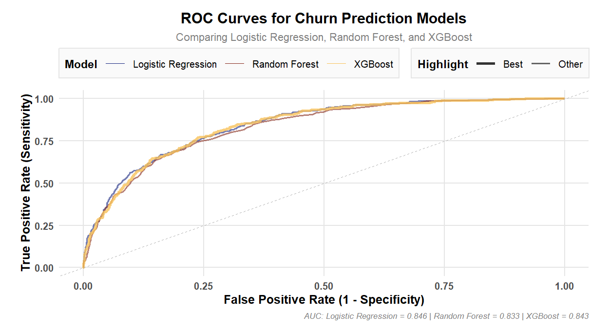
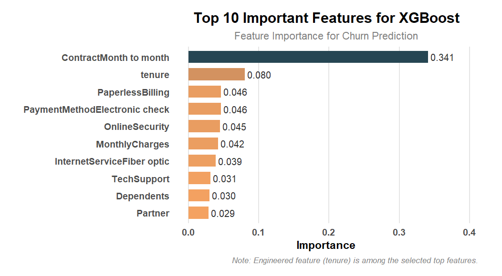
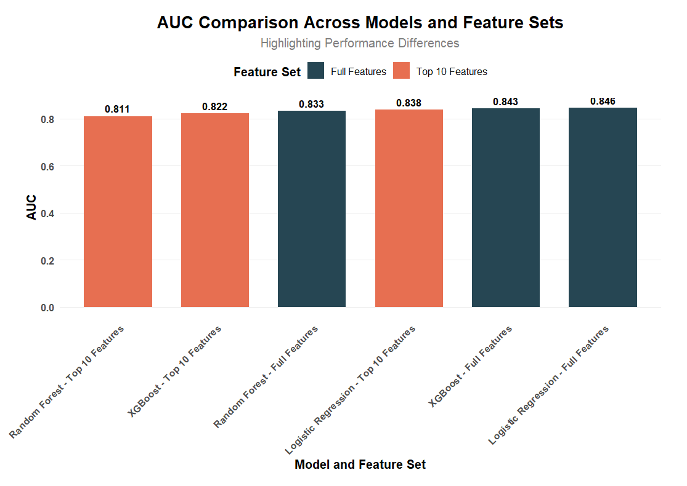

# Telco Customer Churn Prediction

Predicting which telecom customers will churn, and why, using Logistic Regression, Random Forest and XGBoost in R.

## Business problem

The telecom market is highly competitive: switching costs are low and products are hard to differentiate, so customer loyalty is fragile. In this dataset, 26.5% of customers have churned. Acquiring a new customer costs more than keeping an existing one, so the company needs to (1) identify customers at risk of leaving before they leave, and (2) understand which contract, billing and service factors drive churn, so that retention offers can be targeted.

## Data

| Item | Detail |
|---|---|
| Source | [Telco Customer Churn, BlastChar (Kaggle)](https://www.kaggle.com/datasets/blastchar/telco-customer-churn) |
| Size | 7,043 customers, 21 variables (demographics, services, contract, billing, churn flag) |
| Class balance | 73.5% non-churners, 26.5% churners |
| Access | Not committed to this repository. See [data/README.md](data/README.md) for download instructions. |

## Method

1. **Inspection and cleaning.** Converted `TotalCharges` to numeric and imputed its 11 missing values (0.15%, all zero or low tenure customers) from `tenure` and `MonthlyCharges`.
2. **Categorical validation.** Checked every categorical variable for invalid levels (none found) and mapped Yes/No fields to 1/0.
3. **Outlier and distribution checks.** Used IQR and z-score rules on `tenure`, `MonthlyCharges` and `TotalCharges`. No significant outliers were found, and the moderate skew in `TotalCharges` (0.96) was left untransformed.
4. **Standardisation.** Applied z-score scaling to continuous variables.
5. **Feature engineering.** Created `AvgMonthlyCharges` (TotalCharges / tenure) and `TenureGroup` (short, medium and long term), then one-hot encoded the multi-level categorical variables.
6. **Train/test split.** Made a stratified 70/30 split with `set.seed(123)`.
7. **Class balancing.** Applied SMOTE (`smotefamily`, K = 5) to the training set only, which gave 3,622 non-churn and 3,927 churn records. The test set keeps the original distribution.
8. **Modelling.** Trained Logistic Regression, Random Forest (5-fold CV, tuned `mtry`) and XGBoost (3-fold CV, tuned `max_depth`), with ROC AUC as the tuning metric.
9. **Model selection.** Ranked the models on a weighted score: 0.4 × AUC + 0.3 × F1 + 0.2 × Sensitivity + 0.1 × Specificity.
10. **Feature reduction.** Retrained all three models on the top 10 features (ranked by Random Forest importance) and compared their test AUC with the full models.

## Results

Test set performance, as reported in the final report (Table 6):

| Model | AUC | Accuracy | Sensitivity | Specificity | F1 score | Weighted score |
|---|---|---|---|---|---|---|
| Logistic Regression | 0.846 | 0.731 | 0.702 | 0.809 | 0.793 | 0.7976 |
| Random Forest | 0.833 | 0.792 | 0.857 | 0.613 | 0.858 | 0.8233 |
| **XGBoost** | 0.843 | 0.800 | 0.857 | 0.643 | 0.863 | **0.8318** |

XGBoost was selected as the best model on the weighted score (0.8318). Logistic Regression had the highest AUC (0.846).

Full feature set vs top 10 features (test AUC):

| Model | Full features | Top 10 features |
|---|---|---|
| Logistic Regression | 0.846 | 0.838 |
| Random Forest | 0.833 | 0.811 |
| XGBoost | 0.843 | 0.822 |

Reducing the model to the top 10 features costs little discrimination, which makes a lighter model practical to deploy in a CRM system.

Key churn drivers in the XGBoost model were a month-to-month contract (importance 0.341), short tenure, paperless billing, payment by electronic check, and no online security or tech support.

<p align="center">
  
  
</p>
<p align="center">
  
</p>

**Note on metrics.** `caret::confusionMatrix` uses the first factor level (`No`) as the positive class. Sensitivity and F1 in the table therefore refer to the non-churn class, and Specificity is the recall on churners. Measured by churner recall, Logistic Regression catches the most churners (0.809 vs 0.643 for XGBoost), making it the stronger choice when missing a churner is the costlier error.

## Repo structure

```
telco-churn-prediction/
├── churn_model.R          # Full pipeline: cleaning, EDA plots, SMOTE, modelling, evaluation
├── data/
│   └── README.md          # Dataset source and download instructions
├── figures/               # Key figures from the final report
│   ├── roc_curves.png
│   ├── feature_importance_xgboost.png
│   └── auc_full_vs_top10.png
└── README.md
```

## How to run

Requires R 4.x. Tested with R 4.5.1.

```bash
git clone https://github.com/huydang267/telco-churn-prediction.git
cd telco-churn-prediction

# 1. Download WA_Fn-UseC_-Telco-Customer-Churn.csv from Kaggle into data/ (see data/README.md)

# 2. Install the required packages (one time)
Rscript -e 'install.packages(c("dplyr","ggplot2","VIM","mice","moments","scales","patchwork","knitr","corrplot","reshape2","caret","ggcorrplot","randomForest","viridis","smotefamily","pROC","ggthemes","glmnet","xgboost"))'

# 3. Run the full pipeline from the repository root (about 1 to 2 minutes)
Rscript churn_model.R
```

The script prints the tables to the console, writes the processed data to `data/telco_processed.csv`, and saves the ROC, feature importance and AUC comparison plots to `outputs/`.

Logistic Regression results reproduce exactly. Random Forest and XGBoost results can differ slightly between package versions. For example, a re-run with xgboost 1.7.11.1 gave an XGBoost AUC of 0.833 instead of 0.843. The figures and tables above are from the original analysis.

## Context

Course project, RMIT University Vietnam, ISYS3448 Introduction to Business Analytics, Semester A 2025.

Group project (5 members); I led data preprocessing, SMOTE balancing and model comparison.
